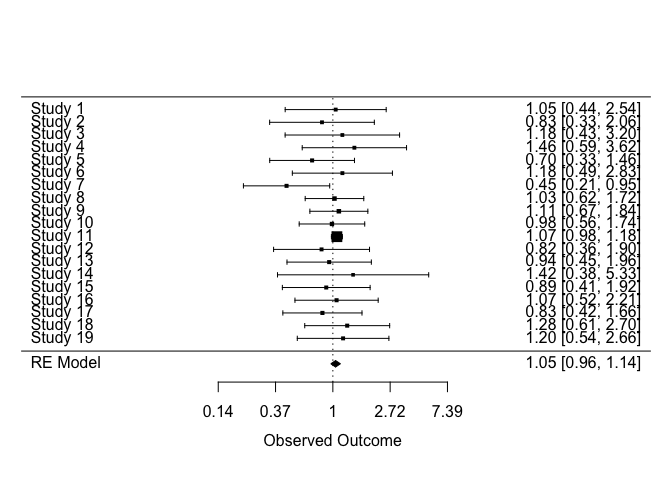

<!-- README.md is generated from README.Rmd. Please edit that file -->

# triangulate

<!-- badges: start -->

[](https://lifecycle.r-lib.org/articles/stages.html#experimental)
[](https://github.com/mcguinlu/triangulate/actions/workflows/R-CMD-check.yaml)
<!-- badges: end -->

The goal of triangulate is to create a generalised version of the
bias-adjusted meta-analysis approach originally proposed by Turner et
al. 

## Installation

``` r
devtools::install_github("mcguinlutriangulate")
```

## :warning: WARNING NOTES

<hr>

> *WARNING \#1:* This package is under development, and as such the API
> is subject to change at any point without warning.

<hr>

> *WARNING \#2:* The approach described requires work in the preparation
> of data to work with the package. Please be sure to read the
> documentation and make use of helper functions to check whether your
> data is set-up right.

<hr>

> *WARNING \#3:* The approach described requires careful choice of valid
> prior distributions of bias/indirectness.

<hr>

## Example

### Datasets

The approach described

``` r
# Load libraries
library(magrittr)
library(triangulate)

# See column names of dat_bias

colnames(dat_bias)
#>  [1] "result_id" "study"     "type"      "yi"        "vi"        "d1j"      
#>  [7] "d2j"       "d3j"       "d4j"       "d5j"       "d6j"       "d7j"      
#> [13] "d1t"       "d2t"       "d3t"       "d4t"       "d5t"       "d6t"      
#> [19] "d7t"       "d1d"       "d2d"       "d3d"       "d4d"       "d5d"      
#> [25] "d6d"       "d7d"

head(dat_bias)
#>   result_id   study type          yi         vi      d1j      d2j      d3j d4j
#> 1   13401-2 Study 1 NRSI -0.12783337 0.12506586     High      Low Moderate Low
#> 2   14632-2 Study 2 NRSI -0.19845094 0.08680919 Moderate Moderate      Low Low
#> 3   14658-2 Study 3 NRSI -0.18632958 0.03361240     High     High      Low Low
#> 4   14665-6 Study 4 NRSI  0.19062036 0.05526578     High Moderate      Low Low
#> 5   14720-1 Study 5 NRSI -0.56211892 0.05141924     High      Low      Low Low
#> 6   14761-1 Study 6 NRSI -0.09431068 0.06969822     High Moderate      Low Low
#>        d5j      d6j      d7j d1t  d2t  d3t  d4t  d5t  d6t  d7t
#> 1      Low      Low Moderate Add None Prop None None None Prop
#> 2      Low Moderate Moderate Add  Add None None None  Add Prop
#> 3      Low Moderate Moderate Add  Add None None None  Add Prop
#> 4      Low      Low Moderate Add  Add None None None None Prop
#> 5 Moderate      Low Moderate Add None None None Prop None Prop
#> 6 Moderate      Low Moderate Add  Add None None Prop None Prop
#>                    d1d                d2d           d3d  d4d           d5d
#> 1   Favours comparator               None Unpredictable None          None
#> 2 Favours experimental Favours comparator          None None          None
#> 3   Favours comparator Favours comparator          None None          None
#> 4   Favours comparator      Unpredictable          None None          None
#> 5   Favours comparator               None          None None Unpredictable
#> 6   Favours comparator Favours comparator          None None Unpredictable
#>             d6d            d7d
#> 1          None Away from null
#> 2 Unpredictable Away from null
#> 3 Unpredictable Away from null
#> 4          None Away from null
#> 5          None Away from null
#> 6          None Away from null

tri_dat_check(dat_bias)
#> Looks good!
#> All expected columns are present in the dataset.
```

For details on how to create these datasets, see the [Creating
triangulation
datasets](https://mcguinlu.github.io/triangulate/articles/Creating-triangulation-datasets.html)
vignette (under construction).

### Absolute directions of bias

The best way to think about this is to consider an example, plotted on a
standard forest plot.

For *additive* bias/indirectness, the position of the point estimate
does not effect the absolute direction of bias. That is, regardless of
whether the point estimate is above or below the null, the absolute
direction of bias/indirectness will be the same.

In contrast, for *proportional bias/indirectness*, the absolute
direction of bias depends on the position of the effect estimate. For
example, if the effect estimate represents a protective effect (below
the null), then bias towards the null would be adjusted for by moving
the effect estimate proportionally to the right. In contrast, if the
effect of the intervention is harmful (effect estimate above the null),
bias towards the null would be adjusted for by moving the effect
estimate proportionally to the left.

Both scenarios are illustrated in the figure below:


Once we load our data, helper functions will convert it to *long* format
and convert to absolute directions of bias/indirectness.

``` r

dat_bias <- triangulate::dat_bias %>%

# Convert to long format
tri_to_long() %>%
  
tri_absolute_direction() %>%

tri_append_bias(triangulate::dat_bias_values)
```

Then apply the same approach to the indirectness dataset:

``` r
dat_ind <- triangulate::dat_ind %>%

# Convert to long format
tri_to_long() %>%
  
tri_absolute_direction() %>%
  
tri_append_indirect(triangulate::dat_ind_values)
```

## Add prior distributions of bias/indirectness

``` r
dat_bias_values
#>   domain        j bias_m_add bias_v_add bias_m_prop bias_v_prop
#> 1    all     high       0.18       0.10        0.06       0.032
#> 2    all moderate       0.09       0.05        0.03       0.016
#> 3    all      low       0.00       0.00        0.00       0.000
```

## Create final dataset and analyse

We now have two clean datasets, one for bias and one for indirectness,
that we can use to

``` r
dat_final <- tri_prep_data(dat_bias, dat_ind)
#> Joining with `by = join_by(result_id)`
#> Joining with `by = join_by(result_id)`
#> Joining with `by = join_by(result_id)`
#> Joining with `by = join_by(result_id)`
```

At this point, we have an unadjusted (*yi*, *vi*) and adjusted
(*yi_adj*, *vi_adj*) estimates for each result.

These estimates can then simply be passed to `metafor` for analysis

``` r

model_adj <- metafor::rma.uni(
  yi = yi_adj,
  vi = vi_adj,
  data = dat_final,
  slab = dat_final$study,
)
#> Warning: Studies with NAs omitted from model fitting.

# Pass model to forest plot function
metafor::forest(
  model_adj,
  atransf = exp,
)
```


