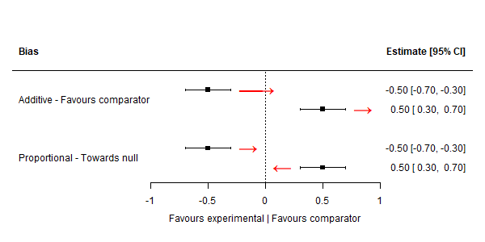

# Absolute direction of bias/indirectness

## Absolute directions of bias/indirectness

The first step of the adjustment is to calculate the absolute direction
of bias/indirectness. A helpful way to understand this. plotted on a
standard forest plot. Note that the red arrows show the absolute
direction of bias, ***not*** the direction of adjustment.



For *additive* bias/indirectness, the position of the point estimate
does not effect the absolute direction of bias. That is, regardless of
whether the point estimate is above or below the null, the absolute
direction of bias/indirectness will be the same.

In contrast, for *proportional bias/indirectness*, the absolute
direction of bias depends on the position of the effect estimate. There
are two scenarios to consider:

### Point estimate below NULL

If the effect estimate is below the null, then *bias towards the null*
would be adjusted for by moving the effect estimate proportionally to
the left. Conversely, *bias away from the null* would be adjusted for
moving the point estimate proportionally to the right.

### Point estimate above NULL - Bias towards the NULL

In contrast, if the effect estimate is below the null, then *bias
towards the null* would be adjusted for by moving the effect estimate
proportionally to the left. Conversely, *bias away from the null* would
be adjusted for moving the point estimate proportionally to the right.

For example, if the effect estimate represents a protective effect
(below the null), then bias towards the null would be adjusted for by
moving the effect estimate proportionally to the right. In contrast, if
the effect of the intervention is harmful (effect estimate above the
null), bias towards the null would be adjusted for by moving the effect
estimate proportionally to the left.

## Adding the adjustment values

The absolute direction is also used when defining the sign of the prior
in the `tri_append_*()` functions. If the bias/indirectness is expected
to pull the effect to the ***right*** (absolute direction = right), it
is given a positive sign. This is because in
[`tri_calculate_adjusted_estimates()`](https://mcguinlu.github.io/triangulate/reference/tri_calculate_adjusted_estimates.md),
we are subtracting the total additive bias from the effect estimate
$y_{i}$.

So to correct for an absolute direction to the ***right***, we want the
sign of the prior to be positive (e.g. *N(0.9, 0.5)*), so that when it
is subtracted from the effect estimate, the overall impact is negative
(and so we shift the effect estimate to the left):

$y_{i} - (0.6)$ = $y_{i} - 0.6$

Conversely, when the assessment is that the absolute direction of bias
is to the ***left***, we want the sign of the bias correction to be
negative (e.g. *N(-0.9, 0.5)*), so that we are shifting the effect
estimate to the right:

$y_{i} - ( - 0.6)$ = $y_{i} + 0.6$

See Section 6.1 of [Turner et
al.](https://rss.onlinelibrary.wiley.com/doi/10.1111/j.1467-985X.2008.00547.x)
for the derivation of these equations.

## Example

To illustrate this and ensure that our code is working correctly, lets
consider a simple dataset of 6 studies, with each study fulfilling one
of the scenarios described above.

``` r
# Create the example dataset
example_data <- tibble(
  result_id = paste0("S", 1:6),  # <-- Add this line
  study = paste("Study", 1:6),
  yi = c(-.2, .25, -.1, -.3, .1, .3),
  vi = round(runif(6, 0.01, 0.05), 3),  # use positive variances
  d1j = rep("moderate", 6),
  d1t = c(rep("add", 2), rep("prop", 4)),
  d1d = c("Favours comparator", "Favours experimental",
          "Away from null", "Towards null",
          "Away from null", "Towards null")
)

# Complete the preparation steps of triangulate
example_data_prepped <- example_data %>%
  tri_to_long() %>%
  tri_absolute_direction() %>%
  tri_append_bias(dat_bias_values)
```

### Additive - Favours comparator - right - positive sign

``` r
example_data[1,]
#> # A tibble: 1 × 7
#>   result_id study      yi    vi d1j      d1t   d1d               
#>   <chr>     <chr>   <dbl> <dbl> <chr>    <chr> <chr>             
#> 1 S1        Study 1  -0.2 0.013 moderate add   Favours comparator
example_data_prepped[1,]
#> # A tibble: 1 × 12
#>   result_id study      yi    vi domain j       t     d     bias_m_add bias_v_add
#>   <chr>     <chr>   <dbl> <dbl> <chr>  <chr>   <chr> <chr>      <dbl>      <dbl>
#> 1 S1        Study 1  -0.2 0.013 d1     modera… add   right       0.09       0.05
#> # ℹ 2 more variables: bias_m_prop <dbl>, bias_v_prop <dbl>
```

### Additive - Favours intervention - left - negative sign

``` r
example_data[2,]
#> # A tibble: 1 × 7
#>   result_id study      yi    vi d1j      d1t   d1d                 
#>   <chr>     <chr>   <dbl> <dbl> <chr>    <chr> <chr>               
#> 1 S2        Study 2  0.25 0.043 moderate add   Favours experimental
example_data_prepped[2,]
#> # A tibble: 1 × 12
#>   result_id study      yi    vi domain j       t     d     bias_m_add bias_v_add
#>   <chr>     <chr>   <dbl> <dbl> <chr>  <chr>   <chr> <chr>      <dbl>      <dbl>
#> 1 S2        Study 2  0.25 0.043 d1     modera… add   left       -0.09       0.05
#> # ℹ 2 more variables: bias_m_prop <dbl>, bias_v_prop <dbl>
```

### Proportional - Point estimate above NULL - Towards the NULL - left - negative sign

``` r
example_data[3,]
#> # A tibble: 1 × 7
#>   result_id study      yi    vi d1j      d1t   d1d           
#>   <chr>     <chr>   <dbl> <dbl> <chr>    <chr> <chr>         
#> 1 S3        Study 3  -0.1 0.034 moderate prop  Away from null
example_data_prepped[3,]
#> # A tibble: 1 × 12
#>   result_id study      yi    vi domain j       t     d     bias_m_add bias_v_add
#>   <chr>     <chr>   <dbl> <dbl> <chr>  <chr>   <chr> <chr>      <dbl>      <dbl>
#> 1 S3        Study 3  -0.1 0.034 d1     modera… prop  left           0          0
#> # ℹ 2 more variables: bias_m_prop <dbl>, bias_v_prop <dbl>
```

### Proportional - Point estimate below NULL - Away from NULL - right - positive sign

``` r
example_data[4,]
#> # A tibble: 1 × 7
#>   result_id study      yi    vi d1j      d1t   d1d         
#>   <chr>     <chr>   <dbl> <dbl> <chr>    <chr> <chr>       
#> 1 S4        Study 4  -0.3 0.016 moderate prop  Towards null
example_data_prepped[4,]
#> # A tibble: 1 × 12
#>   result_id study      yi    vi domain j       t     d     bias_m_add bias_v_add
#>   <chr>     <chr>   <dbl> <dbl> <chr>  <chr>   <chr> <chr>      <dbl>      <dbl>
#> 1 S4        Study 4  -0.3 0.016 d1     modera… prop  right          0          0
#> # ℹ 2 more variables: bias_m_prop <dbl>, bias_v_prop <dbl>
```

### Proportional - Point estimate below NULL - Towards the NULL - right - positive sign

``` r
example_data[5,]
#> # A tibble: 1 × 7
#>   result_id study      yi    vi d1j      d1t   d1d           
#>   <chr>     <chr>   <dbl> <dbl> <chr>    <chr> <chr>         
#> 1 S5        Study 5   0.1  0.01 moderate prop  Away from null
example_data_prepped[5,]
#> # A tibble: 1 × 12
#>   result_id study      yi    vi domain j       t     d     bias_m_add bias_v_add
#>   <chr>     <chr>   <dbl> <dbl> <chr>  <chr>   <chr> <chr>      <dbl>      <dbl>
#> 1 S5        Study 5   0.1  0.01 d1     modera… prop  right          0          0
#> # ℹ 2 more variables: bias_m_prop <dbl>, bias_v_prop <dbl>
```

### Proportional - Point estimate below NULL - Away from NULL - left - negative sign

``` r
example_data[6,]
#> # A tibble: 1 × 7
#>   result_id study      yi    vi d1j      d1t   d1d         
#>   <chr>     <chr>   <dbl> <dbl> <chr>    <chr> <chr>       
#> 1 S6        Study 6   0.3 0.029 moderate prop  Towards null
example_data_prepped[6,]
#> # A tibble: 1 × 12
#>   result_id study      yi    vi domain j       t     d     bias_m_add bias_v_add
#>   <chr>     <chr>   <dbl> <dbl> <chr>  <chr>   <chr> <chr>      <dbl>      <dbl>
#> 1 S6        Study 6   0.3 0.029 d1     modera… prop  left           0          0
#> # ℹ 2 more variables: bias_m_prop <dbl>, bias_v_prop <dbl>
```
